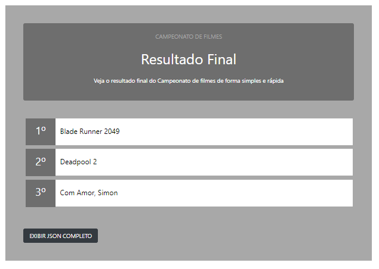

# Copa De Filmes

[]()
[]()
[]()
[]()

Vamos realizar uma copa com seus filmes favoritos?
<p>Essa aplicação disponibiliza uma lista contendo 64 filmes, para que o usuário possa escolhe 16 dentes eles e realizar um campeonato.
<p>Apos escolher os filmes basta clicar em GERAR MEU CAMPEONATO para que a aplicação gere uma verdadeira copa, com fase de grupo, eliminatória, semifinal e a grande final. Com base nas notas dos filmes e de forma automática.
<p>Assim que o campeonato chegar ao fim o usuário e redirecionado para a página com a classificação de primeiro, segundo e terceiro lugar.
<p>Um botão estará disponível para o case de o usuário queira conferir todo o histórico da competição (no formato Json).


## Começando a utilização

### Para utilizar em seu PC localmente

#### Download Do Código Fonte

Usando git

```bash
git clone https://github.com/leandrovboas/CopaFilmes.git
```

Ou pode fazer o Download [aqui](https://github.com/leandrovboas/CopaFilmes/archive/master.zip)


### Utilizando

#### Apos Baixar o Projeto
<p>Abra o projeto utilizando o Visual Studio 2017 Community.
<p>Certifique-se de que o projeto MVC esteja como StartProject. (Passo 1)
<p>E pressione o botão Start <br> (Passo 2)
  
  
  
<p> Apos carregar no browse insira e seguinte URL : http://localhost:55651/Filmes/Index

#### Tela Inicial
<p>Na primeira tela basta selecionar 16 filmes de sua preferencia.
<p>Clique no botão GERAR MEU CAMPEONATO par que a aplicação realize o Campeonato.<br>
  
  
  
#### Tela de Resultado
<p>Na tela de resultado final será exibido a classificação dos três primeiros colocados.
<p>Terá um botão para visualização do histórico do campeonato, no formato json, contendo todas as fase do campeonato.<br>
  
  

## Licence

Source code can be found on [github](https://github.com/georgeOsdDev/markdown-edit), licenced under [MIT](http://opensource.org/licenses/mit-license.php).

Developed by [Leandro Vilas Boas](https://br.linkedin.com/in/leandro-vilas-boas-55403b2b)
